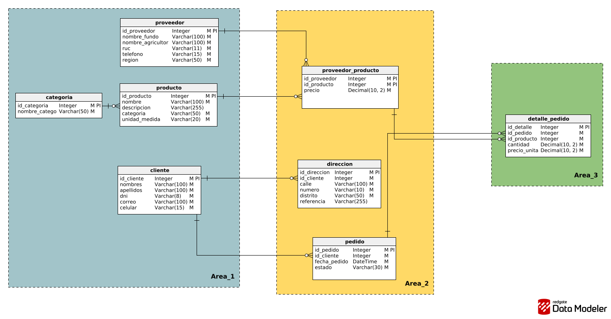
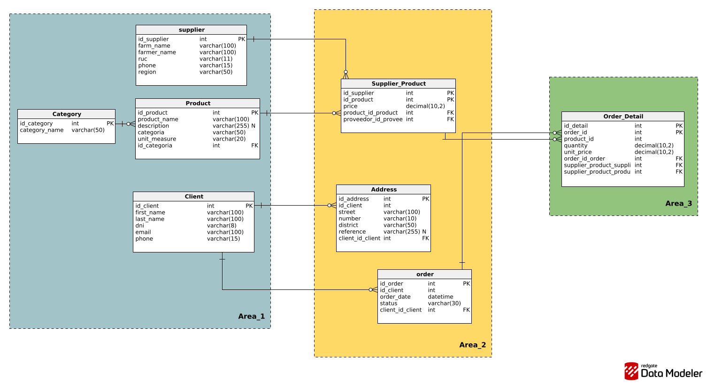

# Diseños de Base de Datos

## Diseño Lógico

[Ver PDF del Diseño Lógico](../resources/Copy_of_AgroConecta_LOGICO.pdf)

## Diseño Físico

[Ver PDF del Diseño Físico](../resources/Copy_of_AgroConecta_FISICO.pdf)

## Diccionario de Datos

[Ver Diccionario de Base de Datos](../documentation/Database_Dictionary.md)
